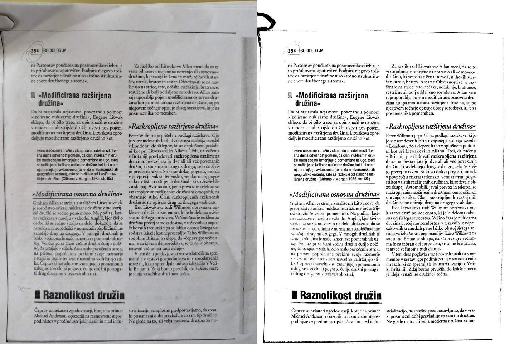

# pdf2scan

Bash script for enhancing scanned/book PDFs. Renders pages to grayscale, applies gamma and contrast, optionally converts to 1-bit (threshold/adaptive), then merges into a compact printable PDF. Parallel and memory-aware.



## Requirements

Ghostscript, ImageMagick, img2pdf, GNU parallel, poppler

### Ubuntu

```bash
sudo apt install ghostscript imagemagick img2pdf parallel poppler-utils
```

### Fedora

```bash
sudo dnf install ghostscript ImageMagick img2pdf parallel poppler-utils
```

### Arch

```bash
sudo pacman -S ghostscript imagemagick img2pdf parallel poppler
```

## Usage

```bash
./pdf2scan.sh [options] input.pdf output.pdf
```

Options:

* `-d, --dpi` render DPI (default 100)
* `-g, --gamma` gamma correction
* `-c, --contrast` brightness/contrast
* `-t, --threshold` convert to 1-bit (e.g. 50%)
* `-a, --adaptive` adaptive 1-bit
* `-q, --quality` JPEG quality (default 60)
* `-v, --verbose` verbose logs
* `-h, --help` show help

